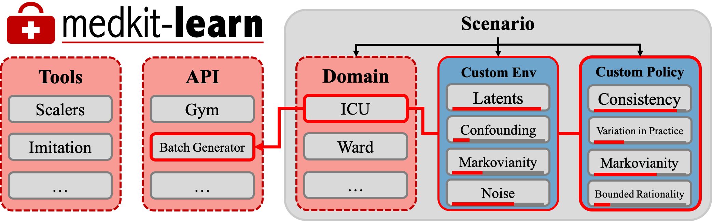

# [The Medkit-learn(ing) Environment](https://arxiv.org/abs/2106.04240)

### Alex J. Chan, Ioana Bica, Alihan Huyuk, Daniel Jarrett, and Mihaela van der Schaar

[](https://opensource.org/licenses/Apache-2.0)
 <a href="https://github.com/psf/black"></a>

The Medkit-Learn(ing) Environment, or Medkit, is a publicly available Python package providing simple and easy access to high-fidelity synthetic medical data.

Primarily, Medkit is a tool that supports: (1) a variety of realistic environment models—learned from actual data, to reflect real medical settings), thus allowing simulation of (2) a variety of expressive and customisable policy models that represent complex human decision-behaviours; as well as (3) ensuring that the environment and policy components are disentangled—hence independently controllable.

By fulfilling the above, Medkit seeks to enable advances in decision modelling to be validated more easily and robustly by enabling users to obtain batch datasets with known ground-truth policy parameterisations that simulate decision making behaviours with various degrees of Markovianity, bounded rationality, confounding, individual consistency and variation in practice.

<p align="center">
    
</p>


Medkit is pip installable - we recommend cloning it, optionally creating a virtual env, and installing it (this will automatically install dependencies):

```shell
git clone https://github.com/XanderJC/medkit-learn.git

cd medkit-learn

pip install -e .
```


Example usage:
```python
import medkit as mk

synthetic_dataset = mk.batch_generate(
    domain = "Ward",
    environment = "CRN",
    policy = "LSTM",
    size = 1000,
    test_size = 200,
    max_length = 10,
    scale = True
)

static_train, observations_train, actions_train = synthetic_dataset['training']
static_test,  observations_test,  actions_test  = synthetic_dataset['testing']
```

While medical machine learning is by necessity almost always entirely offline, we also provide an interface through which you can interact online with the environment should you find that useful. For example, you could train a custom RL policy on this environment with a specified reward function, then you can test inference algorithms on their ability to represent the policy.

```python
env = mk.live_simulate(
    domain="ICU",
    environment="SVAE"
)

static_obs, observation, info = env.reset()
observation, reward, info, done = env.step(action)
```

### Citing

If you use this software please cite as follows:

```bib
@misc{chan2021medkitlearning,
      title={The Medkit-Learn(ing) Environment: Medical Decision Modelling through Simulation},
      author={Alex J. Chan and Ioana Bica and Alihan Huyuk and Daniel Jarrett and Mihaela van der Schaar},
      year={2021},
      eprint={2106.04240},
      archivePrefix={arXiv},
      primaryClass={cs.LG}
}
```
